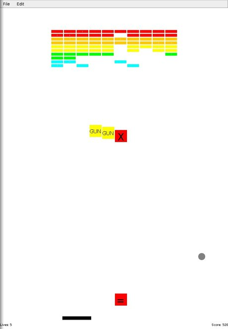

# Breakout

A simple Java Breakout game, supporting

* Rewards
    * rewards can be positive or negative
    * positive rewards include `Gun` (allowing you to shoot the bricks by clicking), `===` (increase length), etc.
    * negative rewards include `==` (shorten length), etc.
* Lives
    * by default you only have 5 lives
* Score
    * displayed at the right bottom corner

